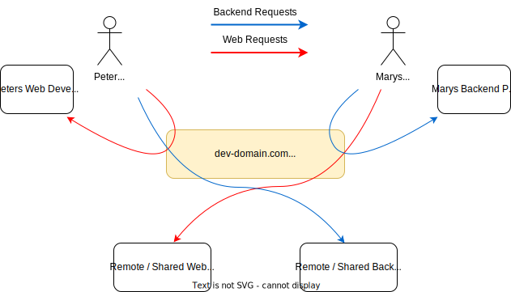

# linkup

> Run the services you change, get the rest for free

Linkup lets you combine local and remote services to create cheap yet complete development environments.

Linkup is written in rust, and uses a combination of cloudflare workers and tunnels under the hood.

## How it works

Engineers often need a complete copy of a system to develop on, even though they only change one or two services at a time.

Linkup lets you create many "virtual copies" of a system, each with a different set of services running locally and remotely. We call each unique virtual copy a _linkup session_.



For example, Peter here can use a local copy of their web development server, but they can use the remote / shared backend server without having to run anything locally.

Mary's pull request can deploy a preview of their backend that can be accessed through the remote / shared web server.

## Using Linkup

To use link up locally the easiest way to get started is to use the linkup cli:

```sh
brew tap mentimeter/mentimeter
brew install linkup
```

Once you have the cli installed you can start a linkup session by running:

```zsh
linkup start      <--- Gives you your unique session name
linkup status     <--- Shows your session is configured
linkup local web  <--- Routes traffic of the `web` service to your local machine
linkup stop       <-- Stops your session
```

## Configuring Linkup

Linkup is configured using a yaml file when you start your linkup session. This file describes the services that make up your system, and how they should be combined into linkup sessions.

Here is an example:

```yaml
linkup:
  remote: https://where.linkup.is.deployed.com
services:
  - name: web
    remote: https://web-dev.hosting-provider.com
    local: http://localhost:3000
    # Can be used to rewrite request paths
    rewrites:
      - source: /foo/(.*)
        target: /bar/$1
  - name: backend
    remote: https://api-dev.hosting-provider.com
    local: http://localhost:9000
    directory: ./
domains:
  - domain: dev-domain.com
    default_service: web
    routes:
      - path: /api/v1/.*
        service: backend
  - domain: api.dev-domain.com
    default_service: backend
```

## Deploying Linkup

In order to run linkup sessions, you need a dedicated domain for linkup to run on and deployed copies of the remote services you want to provide.

Linkup is deployed as a cloudflare worker with a key-value store, and can be deployed using the wrangler cli:

```sh
cd worker
cp wrangler.toml.sample wrangler.toml
# Edit wrangler.toml to point to your cf kv store
npx wrangler@latest deploy
```
