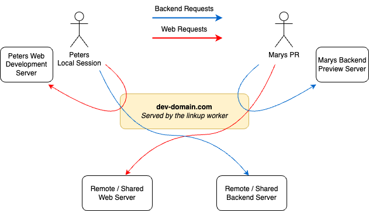

Most modern web applications consist of many services.

Engineers often need a complete copy of a these services to develop and test changes on, even though they only change one or two services at a time.

Linkup reduces the cost of running a complete system copy by combining shared, persistent services with _changed_ services that can run locally or in temporary "preview" environments.

Each "virtual copy" of a system is called a _linkup session_.

For example, Peter here can use a local copy of their web development server, but they can use the remote / shared backend server without having to run anything locally.

Mary's pull request can deploy a preview of their backend that can be accessed through the remote / shared web server.

