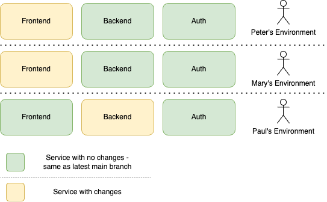

## Summary

Most modern web applications consist of many services.

Engineers often need a complete copy of a these services to develop and test changes on, even though they only change one or two services at a time.

Linkup reduces the cost of running a complete system copy by combining shared, persistent services with _changed_ services that can run locally or in temporary "preview" environments.

Each "virtual copy" of a system is called a _linkup session_.

## The Problem

Let’s start with an example setup that linkup aims to help with:

In order to run Peter, Mary, and Paul's environment, they would need deployed copies of all necessary services: frontend, backend, and auth. Traditionally, we would need 9 running services for these environments to work.

## Linkup's Solution

Linkup answers the question “*Why can't we share the unchanged services?*”. In this case, we would need 6 running services:

- 1 for the shared unchanged *auth* service
- 1 for the shared unchanged *backend* service
- 1 for the shared unchanged *frontend* service
- 3 changed services

For example, Peter here can use a local copy of their web development server, but they can use the remote / shared backend server without having to run anything locally.

Mary's pull request can deploy a preview of their backend that can be accessed through the remote / shared web server.

## Benefits

There are several reasons why sharing services like this can benefit engineering organisations.

1. The overall cost of running many environments for engineers is lower.
2. The speed at which environments can be created at is often faster.
3. Linkup also allows engineers to connect *locally running services* to shared environments, so most development setups become cheaper and easier to run.
